# HP48G(X) Graphic Calculators

Very fast games I did in assembly language, 1995~1998

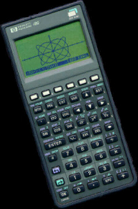

This was the best awesome and powerful graphic calculator at the time and one could build very fast games using assembly language ([See my ebook about SATURN ASM programming](https://jmapp.com/hp48/hp48_assembler_julienmeyer_monlivre.docx)) even with 4 levels of grayscales graphics and fast scrollings. I was so impressed by the fast gameboy-like graphics game made possible on this great calculator, and also because I did scientific/eng studies that I bought one.

[I wrote so many games for this HP48 graphic calculators](https://www.hpcalc.org/authors/8): plenty of time and a memory card for backups! We still find those oldies calcs on eBay and also a great list of Emulators available out there: Emu48, x48 for Desktop and smartphone. I even try to build online emu48 with Javascript: [jsEmu48](http://www.jmapp.com/jsemu48).

## Download SunHP games

[Android](hp48/hp/android.zip), [MarioHP](hp48/hp/mariohp.zip), [TennisHP](hp48/hp/TennisHP.zip), [ArkanoidLite](hp48/hp/arkalite.zip),
[Tron48](hp48/hp/Tron48.zip), [DrMario](hp48/hp/drmario.zip), [Firestarter](hp48/hp/firestarter.zip), [Novanoid](hp48/hp/novanoid.zip), [Meganoid](hp48/hp/meganoid.zip),
[Meganoid Gold](hp48/hp/meganoid_gold.zip), [PinballHP](hp/pinball.zip), [Racer](hp/racer.zip), [SuperMarioHP](hp/SmHP.zip), [SuperMarioHP49](hp/smhp49.zip),
[WarioHP](hp48/hp/wariohp.zip), [WarioHP 2](hp48/hp/wariohp2.zip), [ZeldaHP](hp48/hp/zeldahp.zip)

## Screen captures

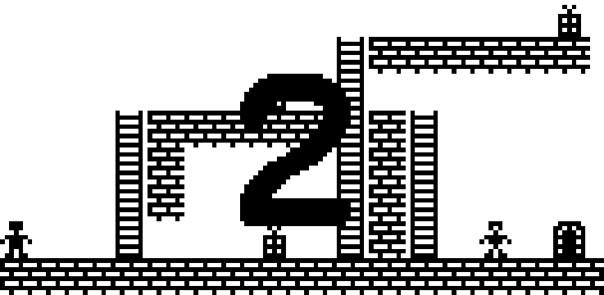

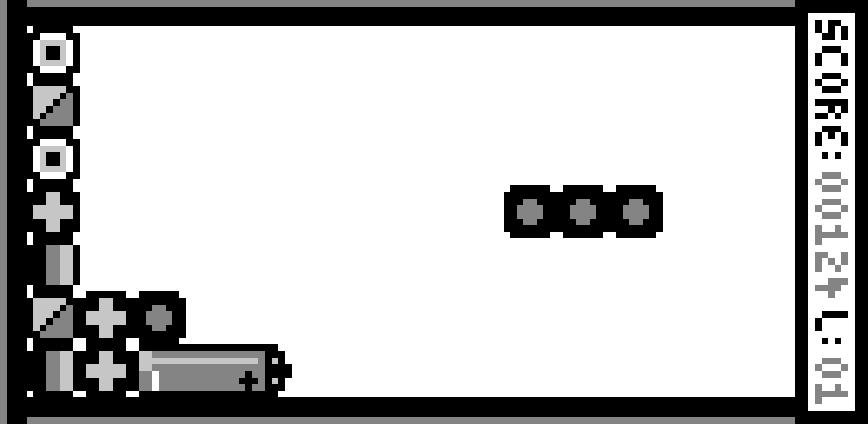
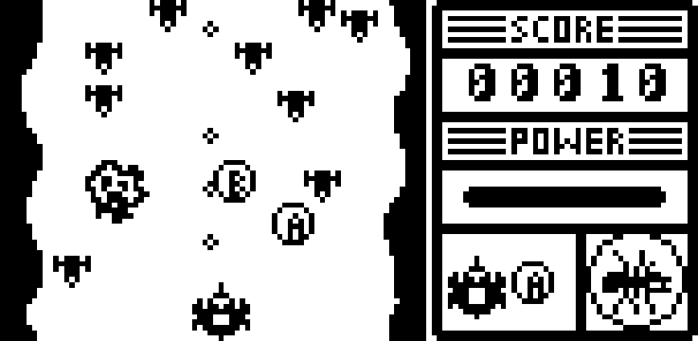
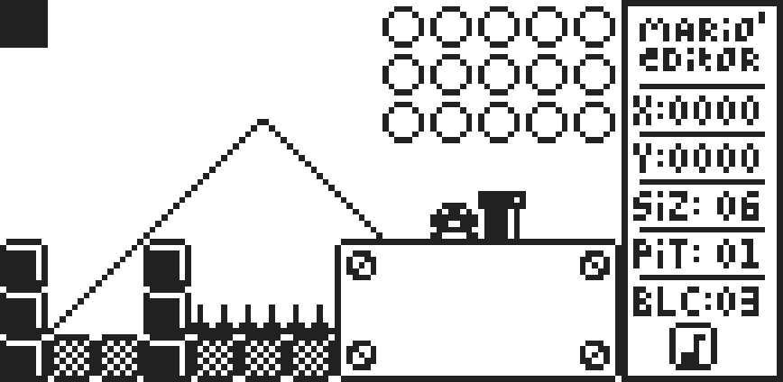
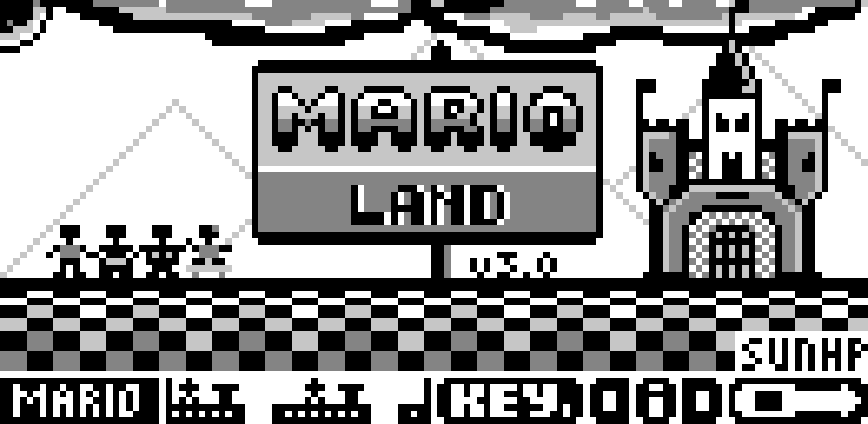
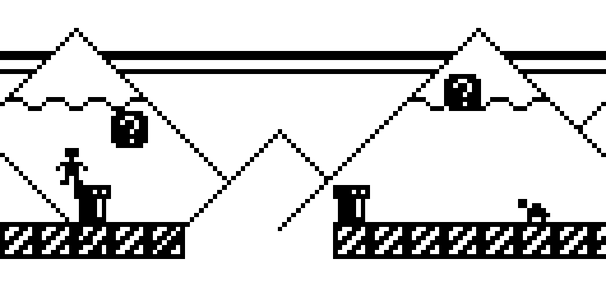

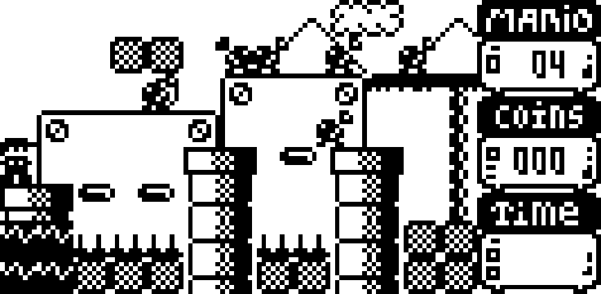

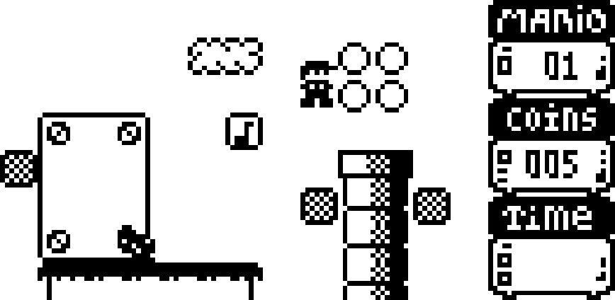
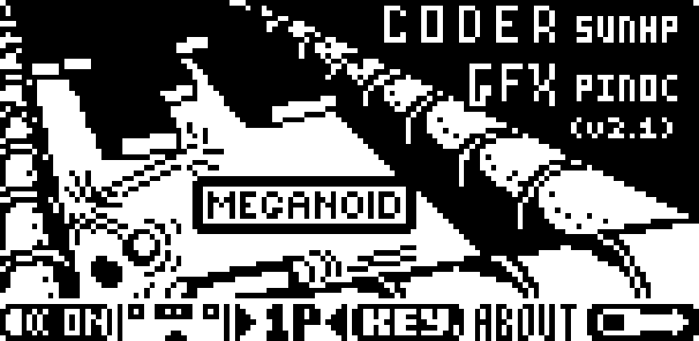
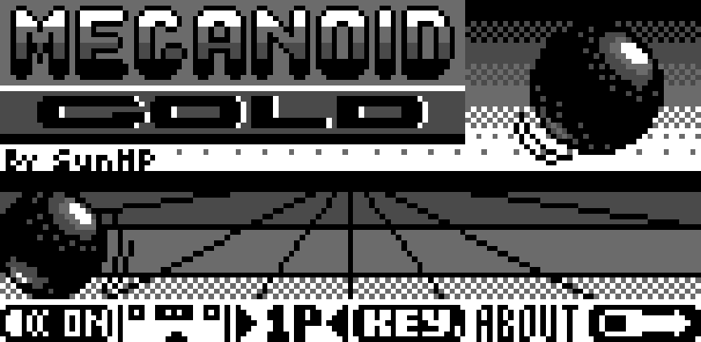

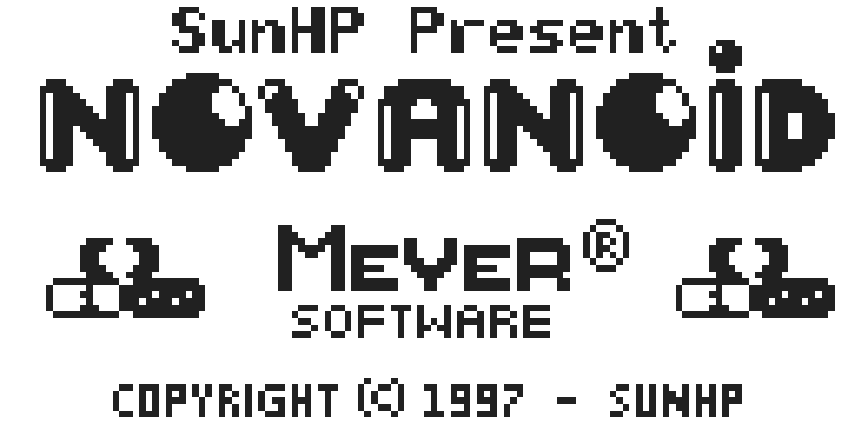
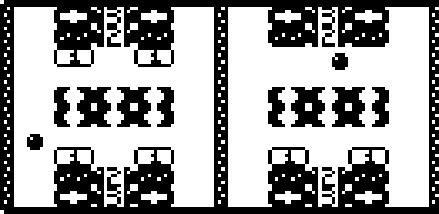
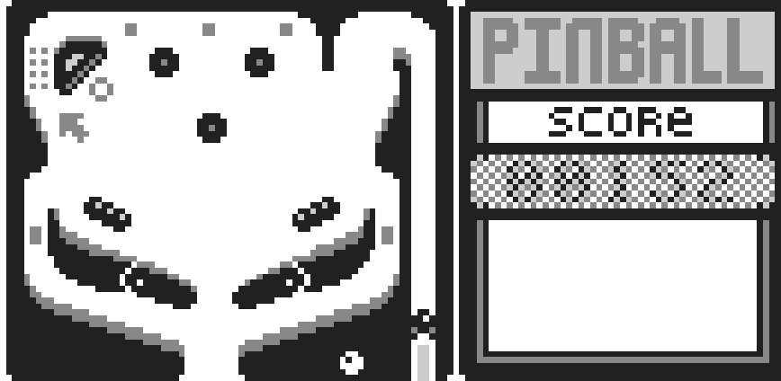
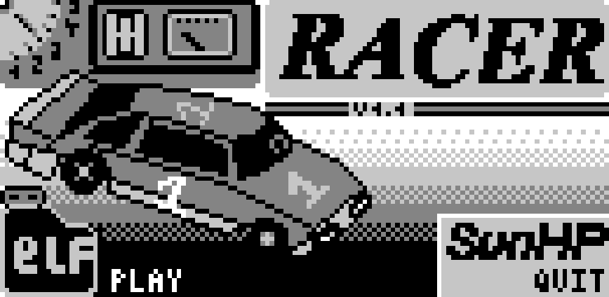

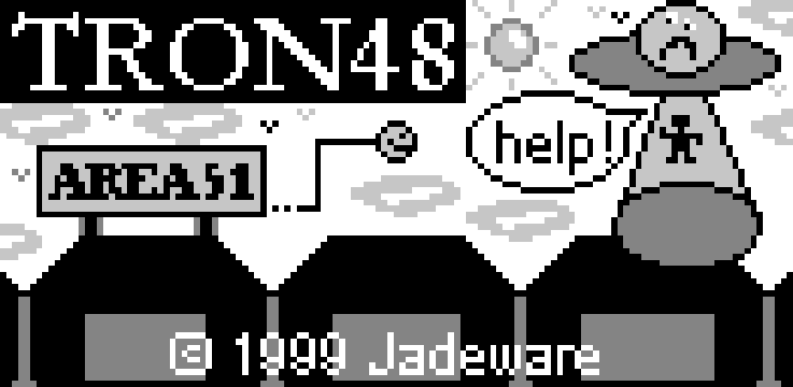
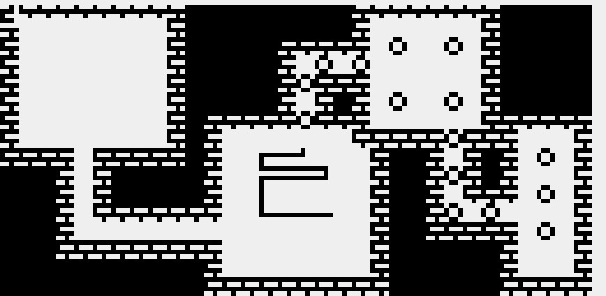

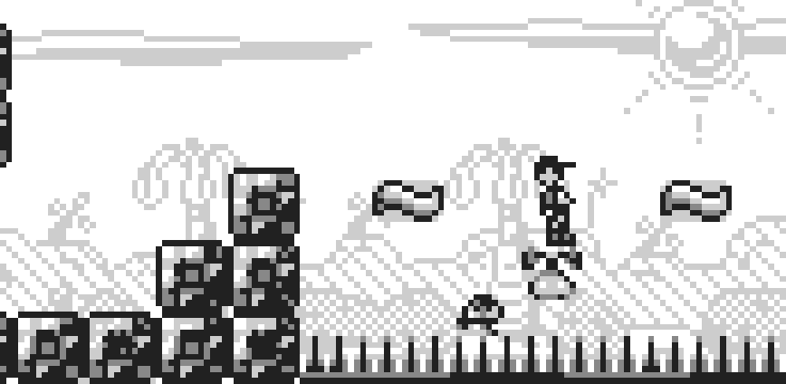
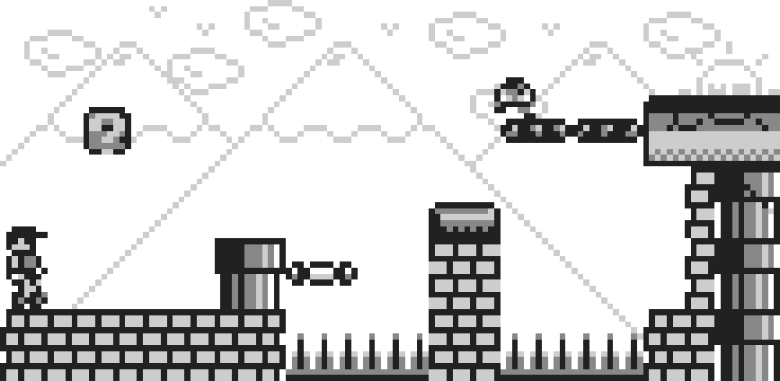
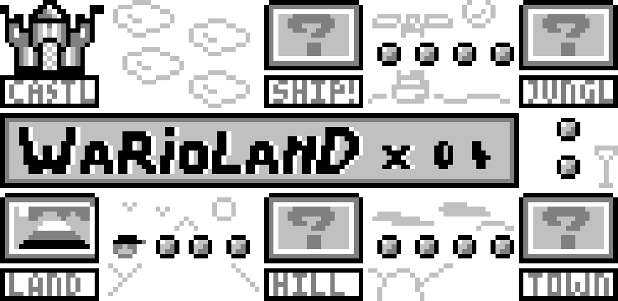

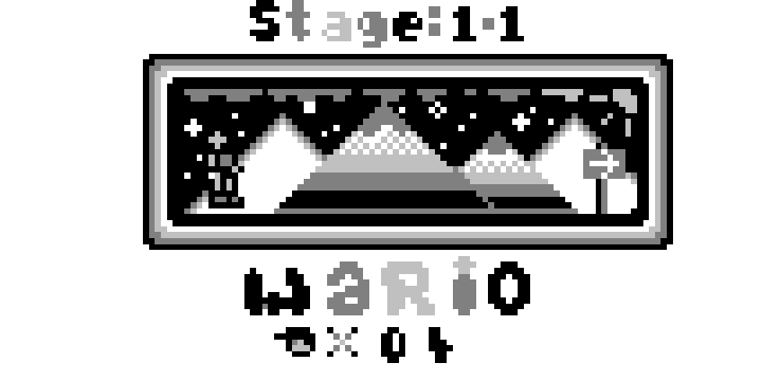

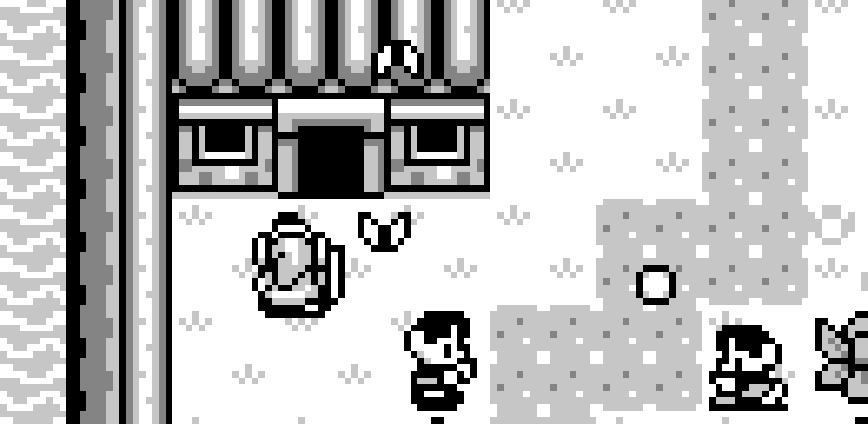
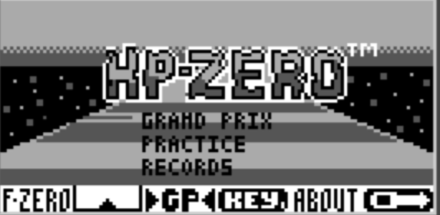

## Videos

- [Video 1](https://www.youtube.com/embed/vl3mAC0uHKk)
- [Video 2](https://www.youtube.com/embed/ejRxdhsT-fk)
- [Video 3](https://www.youtube.com/embed/KugN9DhCMwg)
- [Video 4](https://www.youtube.com/embed/BQYJVWmI6iY)
- [Video 5](https://www.youtube.com/embed/DixX5blnjAY)
- [Video 6](https://www.youtube.com/embed/9Lnu5EEDyao)
- [Video 7](https://www.youtube.com/embed/fwXA2Y8doZA)
- [Video 8](https://www.youtube.com/embed/JLXDdA5AhLw)
- [Video 9](https://www.youtube.com/embed/JAZRyN9s8zg)
- [Video 10](https://www.youtube.com/embed/uD33a1oO8fg)

## Tools and useful links

Saturn Assembly ASM language sources codes available on [Github](https://github.com/brizzly/sunhpgames)

Online HP48G(X) Calc [jsEmu48](https://www.jmapp.com/jsemu48)

Install x48 Emu on your Mac OS X: [x48 Mac](http://macappstore.org/x48/)

Get HP48 emulator on your iPhone [m48+](http://www.mksg.de/m48plus/m48plus.html)

Get HP48 emulator on your Android [droid48](https://play.google.com/store/apps/details?id=org.ab.x48&hl=fr_FR) + [droid48 Reader](https://play.google.com/store/apps/details?id=com.drehersoft.droid48reader&hl=fr_FR)

Programming ebook ASM Saturn (in french) [Cours de programmation HP48 Saturn](https://jmapp.com/hp48/hp48_assembler_julienmeyer_monlivre.docx)

## Good old 3"5 floppy disks

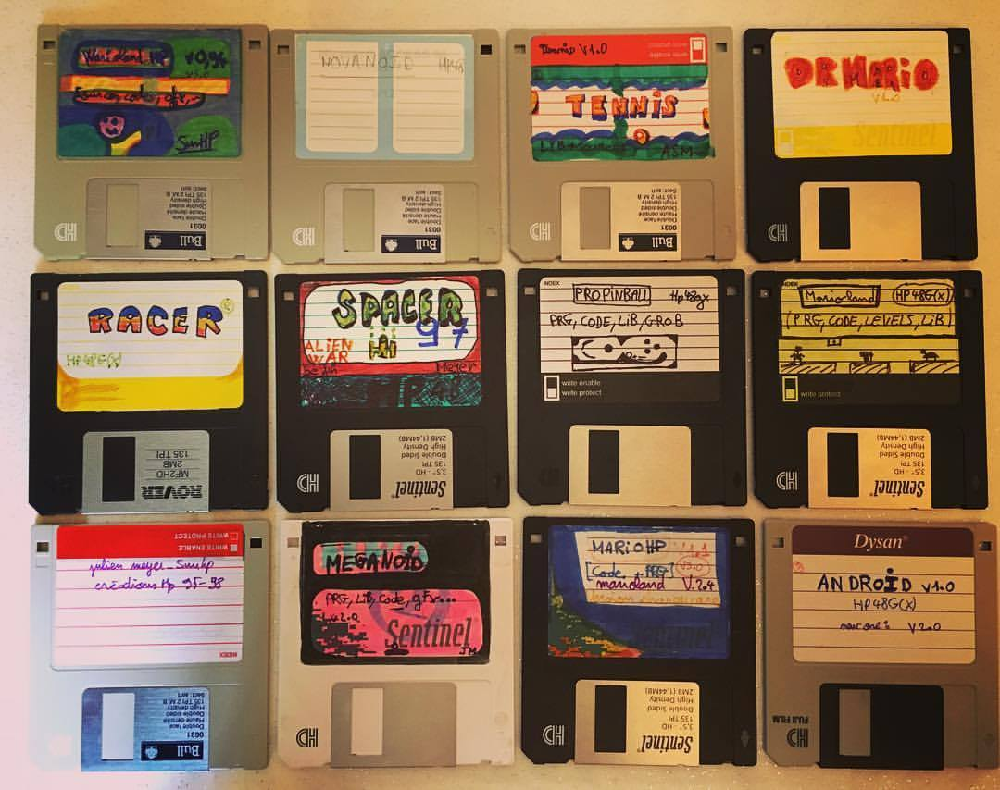
